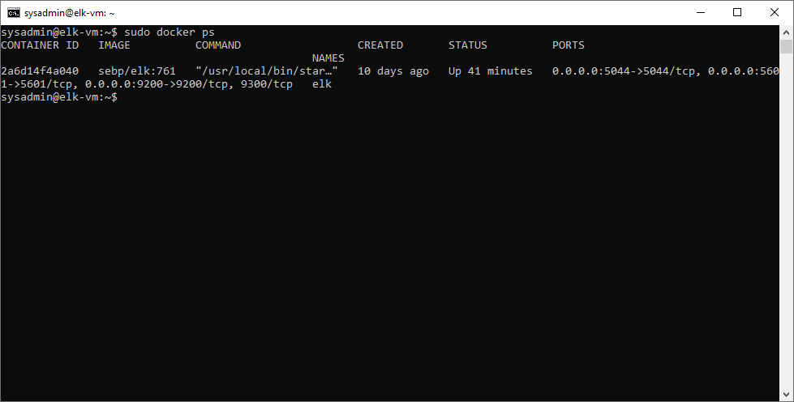

## Automated ELK Stack Deployment

The files in this repository were used to configure the network depicted below.

These files have been tested and used to generate a live ELK deployment on Azure. They can be used to either recreate the entire deployment pictured above. Alternatively, select portions of the filebeat-playbook.yml or   metricbeat-playbook.yml file may be used to install only certain pieces of it, such as Filebeat or Metricbeat.

This document contains the following details:
- Description of the Topologu
- Access Policies
- ELK Configuration
  - Beats in Use
  - Machines Being Monitored
- How to Use the Ansible Build

### Description of the Topology

The main purpose of this network is to expose a load-balanced and monitored instance of DVWA, the D*mn Vulnerable Web Application.

Load balancing ensures that the application will be highly available, in addition to restricting access to the network.

Integrating an ELK server allows users to easily monitor the vulnerable VMs for changes to the system logs/files and system metrics.

The configuration details of each machine may be found below.

| Name     | Function     | IP Address | Operating System |
|----------|--------------|------------|------------------|
| Jump Box | Gateway      | 10.1.0.4   | Linux            |
| Web-1    | Web Server 1 | 10.1.0.5   | Linux            |
| Web-2    | Web Server 2 | 10.1.0.5   | Linux            |
| Web-3    | Web Server 3 | 10.1.0.5   | Linux            |
| elk-vm   | ELK Stack    | 10.0.0.5   | Linux            |

### Access Policies

The machines on the internal network are not exposed to the public Internet. 

Only the Jumpbox and ELK VM machines can accept connections from the Internet. Access to these machines is only allowed from the following IP addresses:
- 98.9.9.9   (Note:  this is a synthetic address and updated as the actual IP address changes for our "Authorized Remote Client")

Machines within the network can only be accessed by Jump Server and ELK VM via the same 98.9.9.9 IP address.

A summary of the access policies in place can be found in the table below.

| Name     | Publicly Accessible | Allowed IP Addresses  |
|----------|---------------------|-----------------------|
| Jump Box |  Yes                | 98.9.9.9 via 22 (SSH) |
| ELK VM   |  Yes                | 98.9.9.9 via 5601     |
| Web-1    |  No                 | Jump Box, ELK VM      |
| Web-2    |  No                 | Jump Box, ELK VM      |
| Web-3    |  No                 | Jump Box, ELK VM      |

### Elk Configuration

Ansible was used to automate configuration of the ELK machine. No configuration was performed manually, which is advantageous because its repeatable and reduces / eliminates mistakes.

The playbook implements the following tasks:
- Download the appropriate Debian package for either filebeat or metricbeat, depending on the deployment being run
- Install the Debian package
- Drop in the appropriate filebeat.yml or metricbeat.yml file
- Enable the module
- Setup filebeat / metricbeat
- Start the Service
- Set the service to start on boot

The following screenshot displays the result of running `docker ps` after successfully configuring the ELK instance.

**Note**: The following image link needs to be updated. Replace `docker_ps_output.png` with the name of your screenshot image file.  

### Target Machines & Beats
This ELK server is configured to monitor the following machines:
- _TODO: List the IP addresses of the machines you are monitoring_

We have installed the following Beats on these machines:
- _TODO: Specify which Beats you successfully installed_

These Beats allow us to collect the following information from each machine:
- _TODO: In 1-2 sentences, explain what kind of data each beat collects, and provide 1 example of what you expect to see. E.g., `Winlogbeat` collects Windows logs, which we use to track user logon events, etc._

### Using the Playbook
In order to use the playbook, you will need to have an Ansible control node already configured. Assuming you have such a control node provisioned: 

SSH into the control node and follow the steps below:
- Copy the _____ file to _____.
- Update the _____ file to include...
- Run the playbook, and navigate to ____ to check that the installation worked as expected.

_TODO: Answer the following questions to fill in the blanks:_
- _Which file is the playbook? Where do you copy it?_
- _Which file do you update to make Ansible run the playbook on a specific machine? How do I specify which machine to install the ELK server on versus which to install Filebeat on?_
- _Which URL do you navigate to in order to check that the ELK server is running?

_As a **Bonus**, provide the specific commands the user will need to run to download the playbook, update the files, etc._
