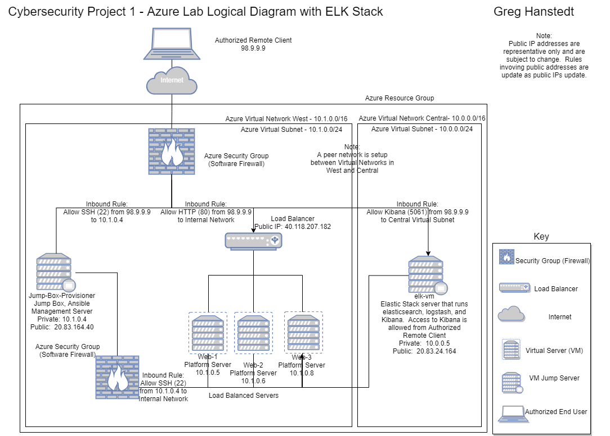

## Automated ELK Stack Deployment

The files in this repository were used to configure the network depicted below.



These files have been tested and used to generate a live ELK deployment on Azure. They can be used to either recreate the entire deployment pictured above. Alternatively, select portions of the filebeat-playbook.yml or   metricbeat-playbook.yml file may be used to install only certain pieces of it, such as Filebeat or Metricbeat.

This document contains the following details:
- Description of the Topologu
- Access Policies
- ELK Configuration
  - Beats in Use
  - Machines Being Monitored
- How to Use the Ansible Build

### Description of the Topology

The main purpose of this network is to expose a load-balanced and monitored instance of DVWA, the D*mn Vulnerable Web Application.

Load balancing ensures that the application will be highly available, in addition to restricting access to the network.

Integrating an ELK server allows users to easily monitor the vulnerable VMs for changes to the system logs/files and system metrics.

The configuration details of each machine may be found below.

| Name     | Function     | IP Address | Operating System |
|----------|--------------|------------|------------------|
| Jump Box | Gateway      | 10.1.0.4   | Linux            |
| Web-1    | Web Server 1 | 10.1.0.5   | Linux            |
| Web-2    | Web Server 2 | 10.1.0.5   | Linux            |
| Web-3    | Web Server 3 | 10.1.0.5   | Linux            |
| elk-vm   | ELK Stack    | 10.0.0.5   | Linux            |

### Access Policies

The machines on the internal network are not exposed to the public Internet. 

Only the Jumpbox and ELK VM machines can accept connections from the Internet. Access to these machines is only allowed from the following IP addresses:
- 98.9.9.9   (Note:  this is a synthetic address and updated as the actual IP address changes for our "Authorized Remote Client")

Machines within the network can only be accessed by Jump Server and ELK VM via the same 98.9.9.9 IP address.

A summary of the access policies in place can be found in the table below.

| Name     | Publicly Accessible | Allowed IP Addresses  |
|----------|---------------------|-----------------------|
| Jump Box |  Yes                | 98.9.9.9 via 22 (SSH) |
| ELK VM   |  Yes                | 98.9.9.9 via 5601     |
| Web-1    |  No                 | Jump Box, ELK VM      |
| Web-2    |  No                 | Jump Box, ELK VM      |
| Web-3    |  No                 | Jump Box, ELK VM      |

### Elk Configuration

Ansible was used to automate configuration of the ELK machine. No configuration was performed manually, which is advantageous because its repeatable and reduces / eliminates mistakes.

The playbook implements the following tasks:
- Download the appropriate Debian package for either filebeat or metricbeat, depending on the deployment being run
- Install the Debian package
- Drop in the appropriate filebeat.yml or metricbeat.yml file
- Enable the module
- Setup filebeat / metricbeat
- Start the Service
- Set the service to start on boot

The following screenshot displays the result of running `docker ps` after successfully configuring the ELK instance.


### Target Machines & Beats
This ELK server is configured to monitor the following machines:
- Web-1 - 10.1.0.5
- Web-2 - 10.1.0.6
- Web-3 - 10.1.0.8

We have installed the following Beats on these machines:
- Filebeat 
- Metricbeat

These Beats allow us to collect the following information from each machine:
- Filebeat  - monitors log and/or locations you specify.  These can be analyzed to see system issues, events as well as find unknown files that appear on the system.
- Metricbeat - collect metrics from the system and other applications like Apache, MySQL, Nginix, etc and ship them for analysis.

### Using the Playbook
In order to use the playbook, you will need to have an Ansible control node already configured. Assuming you have such a control node provisioned: 

SSH into the control node and follow the steps below:
- Attch to your ansible container.  You'll first need to find the appropriate one by looking at your existing containers and seeing which one was recnetly used.  For example:
```
sysadmin@Jump-Box-Provisioner:~$ sudo docker container list -aa
CONTAINER ID   IMAGE                           COMMAND                  CREATED       STATUS                      PORTS     NAMES
d1215acf44ac   cyberxsecurity/ansible:latest   "/bin/sh -c /bin/bas…"   2 weeks ago   Exited (0) 28 seconds ago             cranky_jennings
c098c215f3e2   cyberxsecurity/ansible:latest   "/bin/sh -c /bin/bas…"   2 weeks ago   Exited (0) 2 weeks ago                relaxed_bell
87374042c46f   cyberxsecurity/ansible          "/bin/sh -c /bin/bas…"   2 weeks ago   Exited (0) 2 weeks ago                intelligent_franklin
954d9e0cde1f   cyberxsecurity/ansible          "/bin/sh -c /bin/bas…"   2 weeks ago   Exited (0) 2 weeks ago                zealous_northcutt
cbef4db3abf6   cyberxsecurity/ansible          "/bin/sh -c /bin/bash"   2 weeks ago   Exited (0) 2 weeks ago                dreamy_wilson
dedd26fd98c8   cyberxsecurity/ubuntu:bionic    "bash"                   2 weeks ago   Exited (0) 2 weeks ago                priceless_allen
```
The `cranky_jennings` was most recent.  So we'll start and attach to that:
```
sysadmin@Jump-Box-Provisioner:~$ sudo docker start cranky_jennings
cranky_jennings
sysadmin@Jump-Box-Provisioner:~$ sudo docker attach cranky_jennings
root@d1215acf44ac:~#                                                     
```
- Copy the playbook file to `/etc/ansible` folder within the Ansible container
- Update /etc/ansible/hosts file to reflect the new elk server.  For example, I added:

```
[elk]
10.0.0.5 ansible_python_interpreter=/usr/bin/python3
```

- Run the playbook, and navigate to http://[your.VM.IP]:5601/app/kibana to check that the installation worked as expected.  

For example:

```
root@d1215acf44ac:~# ansible-playbook elk.yml
PLAY [Configure Elk VM with Docker] ****************************************************

TASK [Gathering Facts] *****************************************************************
ok: [10.1.0.4]

TASK [Install docker.io] ***************************************************************
changed: [10.1.0.4]

TASK [Install python3-pip] *************************************************************
changed: [10.1.0.4]

TASK [Install Docker module] ***********************************************************
changed: [10.1.0.4]

TASK [Increase virtual memory] *********************************************************
changed: [10.1.0.4]

TASK [Increase virtual memory on restart] **********************************************
changed: [10.1.0.4]

TASK [download and launch a docker elk container] **************************************
changed: [10.1.0.4]

TASK [Enable service docker on boot] **************************************
changed: [10.1.0.4]

PLAY RECAP *****************************************************************************
10.1.0.4                   : ok=1    changed=7    unreachable=0    failed=0    skipped=0    rescued=0    ignored=0 
```